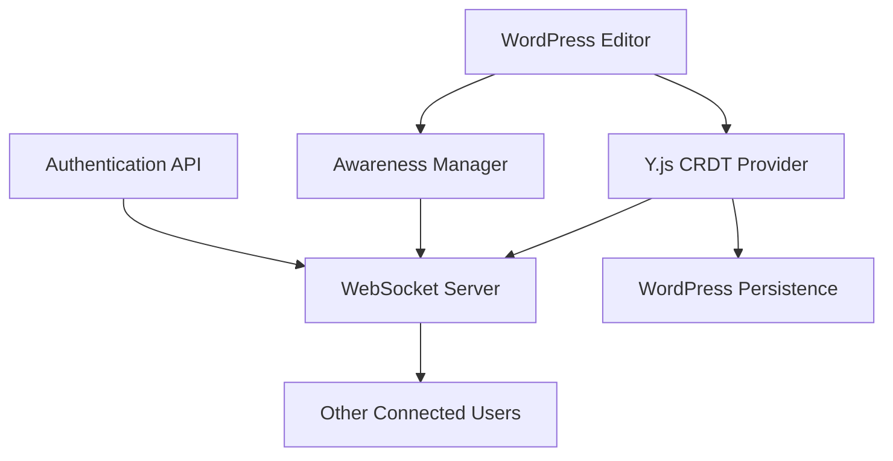
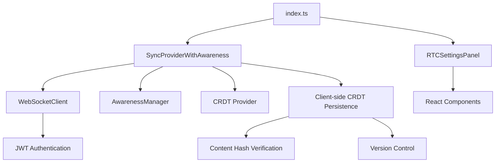
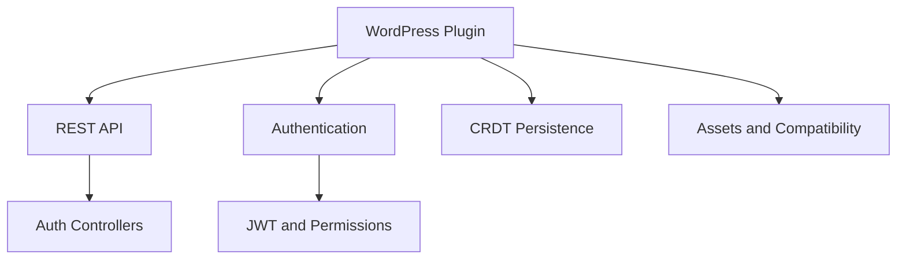
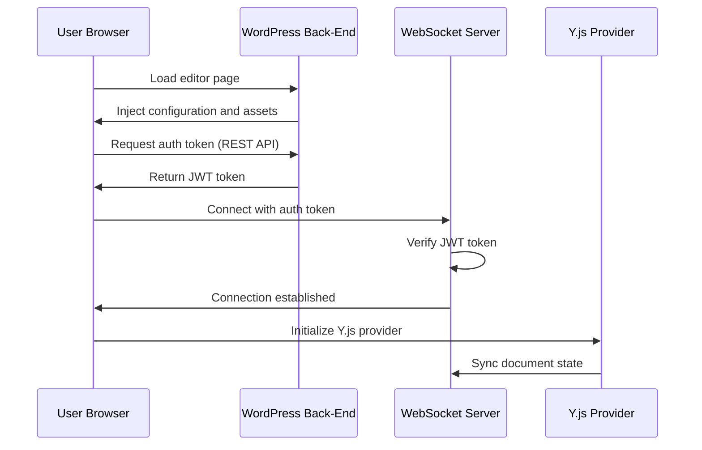
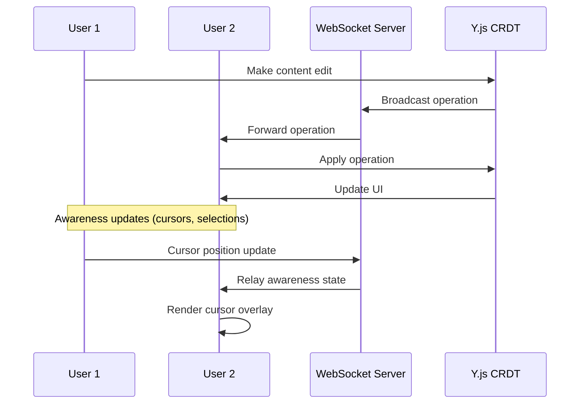
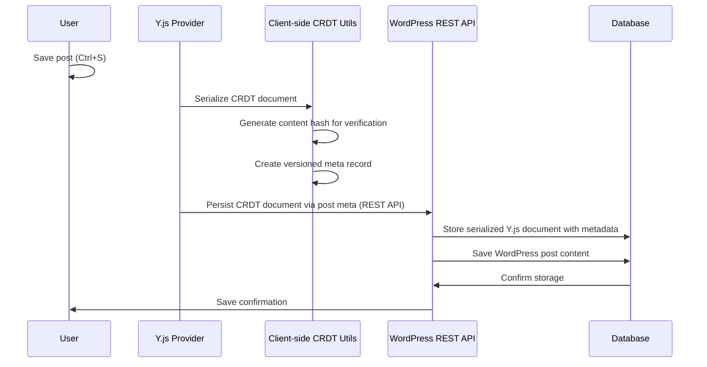

# VIP Real-Time Collaboration System Architecture

## Table of Contents

1. [Overview](#1-overview)
2. [Core Components](#2-core-components)
3. [System Workflows](#3-system-workflows)
4. [Data Flow Architecture](#4-data-flow-architecture)
5. [Configuration and Integration](#5-configuration-and-integration)
6. [Development Tools](#6-development-tools)
7. [Performance and Security](#7-performance-and-security)
8. [Glossary](#8-glossary)

## 1. Overview

The VIP Real-Time Collaboration plugin provides real-time collaborative editing capabilities for the WordPress Block Editor (Gutenberg).

### Key Technologies

- **[Y.js (Yjs)](https://docs.yjs.dev/)**: [Conflict-free Replicated Data Types](https://crdt.tech/) (CRDTs) for operational transformation
- **[WebSockets](https://developer.mozilla.org/en-US/docs/Web/API/WebSockets_API)**: Real-time bidirectional communication
- **[JWT Authentication](https://jwt.io/introduction)**: Secure connection tokens
- **WordPress Sync API**: Built on Gutenberg's experimental sync features

### High-Level Architecture

## 2. Core Components

### 2.1 WordPress Plugin Core

**File**: `vip-real-time-collaboration.php`

- Main plugin entry point and initialization
- Plugin constants, autoloading, and compatibility checks

### 2.2 Front-End Client Architecture

#### Component Overview (`src/`)

#### Key Components

- **SyncProviderWithAwareness** (`provider.ts`): Main sync provider extending WordPress sync, handles document bootstrapping and CRDT persistence
- **AwarenessManager** (`awareness-manager.ts`): Singleton managing user presence, cursor positions, and collaboration state
- **WebSocketClient** (`websocket-client.ts`): Real-time communication with connection monitoring and exponential backoff for reconnections
- **RTCOverlay** (`components/rtc-overlay.tsx`): React component rendering collaborative UI elements in editor iframe
- **React Components** (`components/`): Modular UI for avatars, cursors, highlights, and modals
- **Store Management** (`store/`): WordPress data stores for awareness and settings persistence
- **Hooks and Utilities** (`hooks/`, `utilities/`): Helper functions for selection tracking, entity management, and browser utilities
- **CRDT Utilities** (`utilities/crdt.ts`): Client-side CRDT document serialization, deserialization, content hash verification, and version management
- **Cryptographic Utilities** (`utilities/crypto.ts`): Secure hash generation and UUID creation with fallbacks for non-secure contexts
- **Logging System** (`utilities/logger.ts`): Environment-based logging levels for performance monitoring and debugging

### 2.3 Back-End PHP Architecture

#### Component Overview (`inc/`)

#### Key Components

- **REST API** (`Api/`): WebSocket authentication endpoints
- **Authentication** (`Auth/`): JWT token generation, WebSocket auth, and sync permissions
- **CRDT Persistence** (`Editor/`): Post meta registration with authentication callbacks
- **Assets Management** (`Assets/`): JavaScript/CSS loading and configuration injection
- **Compatibility** (`Compatibility/`): Gutenberg integration and plugin loading requirements
- **Overrides** (`Overrides/`): Disables WordPress post locking and heartbeat for simultaneous editing

### 2.4 WebSocket Server

**Location**: `websocket-server/`

- Node.js server with Y.js WebSocket provider integration
- JWT authentication and connection security
- Metrics collection and real-time message routing

## 3. System Workflows

### 3.1 Connection Establishment

### 3.2 Real-Time Collaboration Flow

### 3.3 Document Persistence

## 4. Data Flow Architecture

### 4.1 Document Synchronization

- **Y.js CRDT**: Maintains document state with operational transformation and version control
- **Client-side Persistence**: CRDT document serialization, content hash verification, and persistence logic
- **WebSocket Provider**: Real-time bidirectional communication with exponential backoff for connection retries
- **WordPress Post Meta**: CRDT document storage via WordPress's built-in post meta system

### 4.2 Awareness System

- **User Presence**: Track active collaborators
- **Cursor Positions**: Show real-time cursor locations
- **Block Highlighting**: Indicate which blocks users are editing
- **User Avatars**: Display collaborator information

### 4.3 Authentication Flow

- **JWT Tokens**: Secure WebSocket connections with time-limited tokens
- **WordPress Permissions**: Leverage existing WordPress user capabilities
- **Connection Validation**: Verify user permissions for each document

## 5. Configuration and Integration

### 5.1 Environment Variables

- `VIP_RTC_WS_URL`: WebSocket server URL
- `VIP_RTC_WS_AUTH_SECRET`: JWT secret for authentication

### 5.2 WordPress Integration Features

- **Sync Experiment**: Built on Gutenberg's sync experiment
- **WordPress Sync API**: Extends [`@wordpress/sync`](https://developer.wordpress.org/block-editor/reference-guides/packages/packages-sync/)
- **Post Lock Override**: Disables WordPress native post locking for simultaneous editing
- **Site Editor Exclusion**: Automatically disables in Site Editor (FSE)
- **Post Type Support**: Auto-detects post types with `collaborative-editing` and `editor` support

### 5.3 Permission System

- **Custom Capabilities**: Adds `sync_post` capability mapped to `edit_post` permissions
- **Post Meta Authentication**: Post meta access controlled by authentication callbacks
- **Permission Filters**:
  - `vip_rtc_post_sync_check_permission`: Custom post permission logic
  - `vip_rtc_entity_sync_check_permission`: Custom entity permission logic

### 5.4 WordPress Hooks Integration

- **Action Hooks**: `vip_real_time_collaboration_loaded` for extensibility
- **Sync Provider Registration**: Uses `core.getSyncProvider` filter
- **WordPress Meta API**: Post meta storage with revision support

## 6. Development Tools

### 6.1 Y.js Inspector (`yjs-inspector/`)

- Visual debugging tool for Y.js documents
- Connection monitoring and state inspection
- Development and testing support

### 6.2 Build System

- **Webpack**: Asset compilation and bundling
- **TypeScript**: Type-safe development
- **SCSS**: Styling for collaboration components

## 7. Performance and Security

### 7.1 Performance Optimizations

- **Debounced Updates**: Awareness updates debounced to reduce network traffic
- **Efficient Serialization**: Y.js binary encoding for minimal data transfer
- **Connection Pooling**: WebSocket server handles multiple concurrent connections
- **Connection Resilience**: Exponential backoff for WebSocket reconnection attempts
- **Memory Management**: Cleanup of awareness states on disconnect

### 7.2 Security Model

- **WordPress Authentication**: Leverages WordPress user system
- **JWT Tokens**: Secure, time-limited connection tokens
- **Permission Validation**: Respects WordPress post editing permissions with authentication callbacks
- **Connection Isolation**: Users can only access authorized documents
- **Content Integrity**: Cryptographic hash verification for document content
- **Secure Context Handling**: Fallback implementations for non-secure contexts in development

## 8. Glossary

- **CRDT**: Conflict-free Replicated Data Types - data structures that automatically resolve conflicts
- **Y.js**: JavaScript CRDT implementation for collaborative applications
- **JWT**: JSON Web Tokens - secure method for transmitting information between parties
- **WebSocket**: Protocol for full-duplex communication over a single TCP connection
- **Awareness**: Real-time information about user presence and activity in collaborative editing
- **Operational Transformation**: Technique for maintaining consistency in collaborative editing
