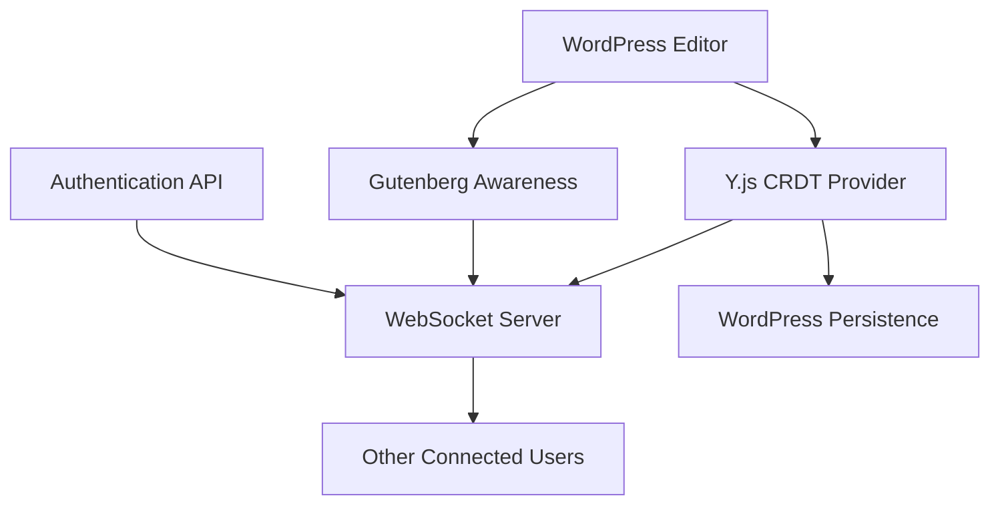
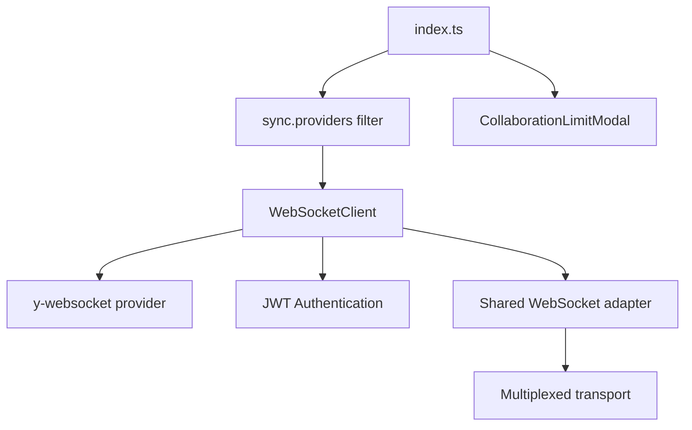
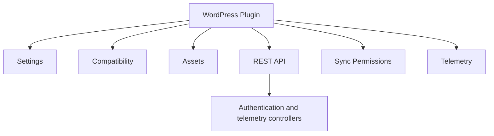
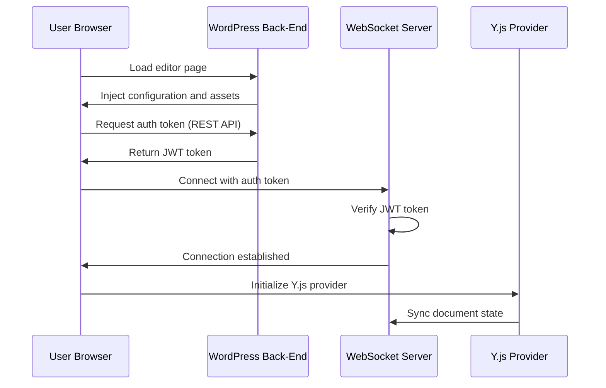
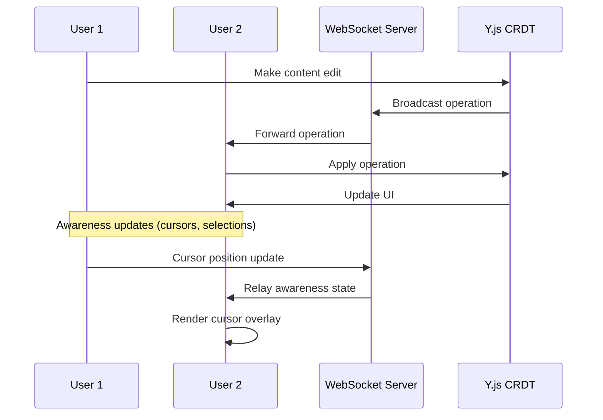
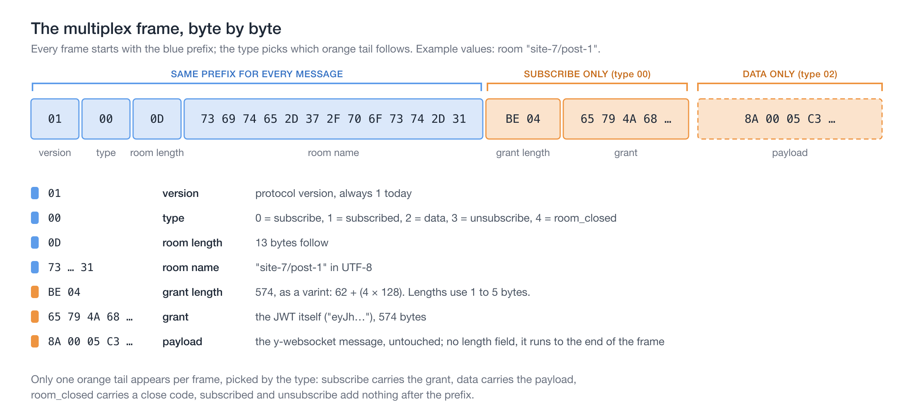

# VIP Real-Time Collaboration System Architecture

## Table of Contents

1. [Overview](#1-overview)
2. [Core Components](#2-core-components)
3. [System Workflows](#3-system-workflows)
4. [Data Flow Architecture](#4-data-flow-architecture)
5. [Configuration and Integration](#5-configuration-and-integration)
6. [Development Tools](#6-development-tools)
7. [Performance and Security](#7-performance-and-security)
8. [Glossary](#8-glossary)

## 1. Overview

The VIP Real-Time Collaboration plugin provides real-time collaborative editing capabilities for the WordPress Block Editor (Gutenberg).

### Key Technologies

- **[Y.js (Yjs)](https://docs.yjs.dev/)**: [Conflict-free Replicated Data Types](https://crdt.tech/) (CRDTs) for convergent collaborative state
- **[WebSockets](https://developer.mozilla.org/en-US/docs/Web/API/WebSockets_API)**: Real-time bidirectional communication
- **[JWT Authentication](https://jwt.io/introduction)**: Secure connection tokens
- **WordPress Sync API**: Gutenberg's collaboration and CRDT infrastructure, exposed through `@wordpress/sync`

For the Gutenberg-owned document model, provider API, persistence, awareness, and undo behavior, see Gutenberg's [Real-time collaboration architecture](https://github.com/WordPress/gutenberg/blob/trunk/packages/sync/CODE.md).

### High-Level Architecture

```mermaid
graph TB
    A[WordPress Editor] --> B[Y.js CRDT Provider]
    A --> C[Gutenberg Awareness]
    B --> D[WebSocket Server]
    C --> D
    D --> E[Other Connected Users]
    B --> F[WordPress Persistence]
    G[Authentication API] --> D
```

## 2. Core Components

### 2.1 WordPress Plugin Core

**File**: `vip-real-time-collaboration.php`

- Main plugin entry point and initialization
- Plugin constants, autoloading, and compatibility checks

### 2.2 Front-End Client Architecture

#### Component Overview (`src/`)

```mermaid
graph TB
    A[index.ts] --> B[sync.providers filter]
    A --> C[CollaborationLimitModal]
    B --> D[WebSocketClient]
    D --> E[y-websocket provider]
    D --> F[JWT Authentication]
    D --> G[Shared WebSocket adapter]
    G --> H[Multiplexed transport]
```

#### Key Components

- **Provider registration** (`index.ts`): Replaces Gutenberg's default polling provider through the `sync.providers` filter
- **WebSocket client** (`websocket-client.ts`): Creates authenticated Yjs providers and handles connection status, limits, and retry behavior
- **Shared WebSocket adapter** (`shared-websocket.ts`): Optionally multiplexes several collaboration rooms over one physical WebSocket
- **Connection-limit modal** (`components/collaboration-limit-modal.tsx`): Handles VIP-specific collaborator and connection limit errors
- **Cryptographic utilities** (`utilities/crypto.ts`): Generates client identifiers, with a fallback for non-secure local development
- **Logging System** (`utilities/logger.ts`): Environment-based logging levels for performance monitoring and debugging

Gutenberg owns the editor's CRDT documents, awareness state, persistence, and collaborative UI. This plugin supplies the VIP WebSocket transport and its operational UI.

### 2.3 Back-End PHP Architecture

#### Component Overview (`inc/`)

```mermaid
graph TB
    A[WordPress Plugin] --> B[Settings]
    A --> C[Compatibility]
    A --> D[Assets]
    A --> E[REST API]
    A --> F[Sync Permissions]
    A --> G[Telemetry]
    E --> H[Authentication and telemetry controllers]
```

#### Key Components

- **REST API** (`Api/`): WebSocket authentication endpoints
- **Authentication** (`Auth/`): JWT token generation, WebSocket auth, and sync permissions
- **Assets Management** (`Assets/`): JavaScript loading and configuration injection
- **Compatibility** (`Compatibility/`): Gutenberg and WebSocket configuration requirements
- **Settings** (`Settings/`): Emergency enable/disable control and Gutenberg RTC experiment management
- **Telemetry** (`Telemetry/`): Plugin lifecycle and editor event reporting on supported VIP environments

### 2.4 WebSocket Server

**Location**: `websocket-server/`

- Node.js server with Y.js WebSocket provider integration
- JWT authentication and connection security
- Metrics collection and real-time message routing

## 3. System Workflows

### 3.1 Connection Establishment

```mermaid
sequenceDiagram
    participant User as User Browser
    participant WP as WordPress Back-End
    participant WS as WebSocket Server
    participant YJS as Y.js Provider

    User->>WP: Load editor page
    WP->>User: Inject configuration and assets
    User->>WP: Request auth token (REST API)
    WP->>User: Return JWT token
    User->>WS: Connect with auth token
    WS->>WS: Verify JWT token
    WS->>User: Connection established
    User->>YJS: Initialize Y.js provider
    YJS->>WS: Sync document state
```

### 3.2 Real-Time Collaboration Flow

```mermaid
sequenceDiagram
    participant U1 as User 1
    participant U2 as User 2
    participant WS as WebSocket Server
    participant YJS as Y.js CRDT

    U1->>YJS: Make content edit
    YJS->>WS: Broadcast operation
    WS->>U2: Forward operation
    U2->>YJS: Apply operation
    YJS->>U2: Update UI

    Note over U1,U2: Awareness updates (cursors, selections)
    U1->>WS: Cursor position update
    WS->>U2: Relay awareness state
    U2->>U2: Render cursor overlay
```

### 3.3 Document Persistence

Gutenberg owns CRDT serialization, restoration, and persistence through Core Data. This plugin does not replace that persistence path; it replaces only the provider that carries live updates between peers. See Gutenberg's [Persistence documentation](https://github.com/WordPress/gutenberg/blob/trunk/packages/sync/CODE.md#persistence).

## 4. Data Flow Architecture

### 4.1 Document Synchronization

- **Gutenberg document model**: Gutenberg owns CRDT state, entity synchronization, persistence, and undo behavior, as described in its [Sync architecture](https://github.com/WordPress/gutenberg/blob/trunk/packages/sync/CODE.md)
- **VIP WebSocket provider**: This plugin replaces Gutenberg's default polling provider with real-time bidirectional communication and exponential backoff for connection retries

### 4.2 Awareness System

Gutenberg manages collaborator presence and awareness UI. The VIP WebSocket provider carries the associated Yjs awareness updates between connected editors. See Gutenberg's [Awareness documentation](https://github.com/WordPress/gutenberg/blob/trunk/packages/sync/CODE.md#awareness).

### 4.3 Authentication Flow

- **JWT Tokens**: Secure WebSocket connections with time-limited tokens
- **Post Permissions**: Post entities require the corresponding `edit_post` permission through the `sync_post` capability
- **Persistence Authorization**: Gutenberg protects `_crdt_document` post meta with an `edit_post` authentication callback in its [collaboration bootstrap](https://github.com/WordPress/gutenberg/blob/trunk/lib/experimental/collaboration/collaboration.php)
- **Extensible Permissions**: Collections and other entity types use the `vip_rtc_entity_sync_check_permission` filter after authentication

## 5. Configuration and Integration

### 5.1 Environment Variables

- `VIP_RTC_WS_URL`: WebSocket server URL
- `VIP_RTC_WS_AUTH_SECRET`: JWT secret for authentication
- `VIP_RTC_WS_MULTIPLEXING_ENABLED`: Share one multiplexed WebSocket across all rooms (default: off, see 5.5)

### 5.2 WordPress Integration Features

- **RTC Experiment**: Enabled by this plugin and controlled from its settings page; Gutenberg defines it in the [experiments registration](https://github.com/WordPress/gutenberg/blob/trunk/lib/experimental/experiments/load.php)
- **WordPress Sync API**: Integrates with [`@wordpress/sync`](https://developer.wordpress.org/block-editor/reference-guides/packages/packages-sync/) using Gutenberg's documented [custom provider interface](https://github.com/WordPress/gutenberg/blob/trunk/packages/sync/CODE.md#custom-providers)
- **Provider replacement**: Uses `sync.providers` to replace Gutenberg's [default HTTP polling provider](https://github.com/WordPress/gutenberg/blob/trunk/packages/sync/src/providers/http-polling/README.md)
- **Site Editor Exclusion**: Gutenberg disables RTC in both Site Editor implementations in its [editor experiment settings](https://github.com/WordPress/gutenberg/blob/trunk/lib/experimental/editor-settings.php)
- **Entity Support**: Gutenberg supplies sync configuration; the VIP provider supports post-type entities and collections

### 5.3 Permission System

- **Custom Capabilities**: Adds `sync_post` capability mapped to `edit_post` permissions
- **Permission Filters**:
  - `vip_rtc_post_sync_check_permission`: Custom post permission logic
  - `vip_rtc_entity_sync_check_permission`: Custom entity permission logic

### 5.4 WordPress Hooks Integration

- **Action Hooks**: `vip_real_time_collaboration_loaded` for extensibility
- **Sync Provider Registration**: Uses the `sync.providers` filter

### 5.5 Multiplexed WebSocket Transport

By default, each collaboration room opens its own WebSocket. With multiplexing enabled, all rooms in one editor session share a single physical WebSocket, and a small binary protocol (`vip-rtc-multiplex-v1`) routes each room's traffic over it.

Multiplexing is controlled by the `VIP_RTC_WS_MULTIPLEXING_ENABLED` PHP constant, passed to the editor through the `VIP_RTC` script data. It is off unless the constant is exactly `true`, so an environment can be switched to either transport through its configuration, without a plugin release. The server accepts both transports at once: a client that offers the `vip-rtc-multiplex-v1` subprotocol gets multiplexing, and a client that offers none gets the legacy per-room handler.

Every frame starts with the same prefix (version, type, room name) and ends with a type-specific tail. The room name is the routing key: each frame belongs to exactly one room, and both sides hand its payload to that room's socket and Yjs doc.

| Message       | Sent by | Meaning                                                        |
| ------------- | ------- | -------------------------------------------------------------- |
| `subscribe`   | client  | Join a room; carries a grant that authorizes this room only    |
| `subscribed`  | server  | The room is joined; room data can now flow                     |
| `data`        | both    | An unchanged y-websocket message, tagged with its room         |
| `unsubscribe` | client  | Leave a room; the connection stays open                        |
| `room_closed` | server  | The server closed one room (`4004` terminal, `4005` retryable) |

Room failures stay scoped to the room: a `4004` or `4005` close stops or retries that room while sibling rooms keep syncing. Connection-scoped closes (for example `4001` token rotation) affect every room and restore them over one replacement socket.

## 6. Development Tools

### 6.1 Y.js Inspector (`yjs-inspector/`)

- Visual debugging tool for Y.js documents
- Connection monitoring and state inspection
- Development and testing support

### 6.2 Build System

- **Webpack**: Asset compilation and bundling
- **TypeScript**: Type-safe development

## 7. Performance and Security

### 7.1 Performance Optimizations

- **Efficient Serialization**: Yjs uses binary updates for synchronization
- **Connection Pooling**: Optional multiplexing shares one physical WebSocket across several rooms
- **Connection Resilience**: Exponential backoff for WebSocket reconnection attempts
- **Memory Management**: Cleanup of awareness states on disconnect

### 7.2 Security Model

- **WordPress Authentication**: Leverages WordPress user system
- **JWT Tokens**: Secure, time-limited connection tokens
- **Permission Validation**: The plugin requires `edit_post` permission before issuing post-entity tokens, and Gutenberg protects persisted CRDT post meta with the same permission
- **Connection Isolation**: Users can only access authorized documents
- **Client Identifiers**: Uses `crypto.randomUUID()` in secure contexts, with a UUID fallback for non-secure local development

## 8. Glossary

- **CRDT**: Conflict-free Replicated Data Types - data structures that automatically resolve conflicts
- **Y.js**: JavaScript CRDT implementation for collaborative applications
- **JWT**: JSON Web Tokens - secure method for transmitting information between parties
- **WebSocket**: Protocol for full-duplex communication over a single TCP connection
- **Awareness**: Real-time information about user presence and activity in collaborative editing
